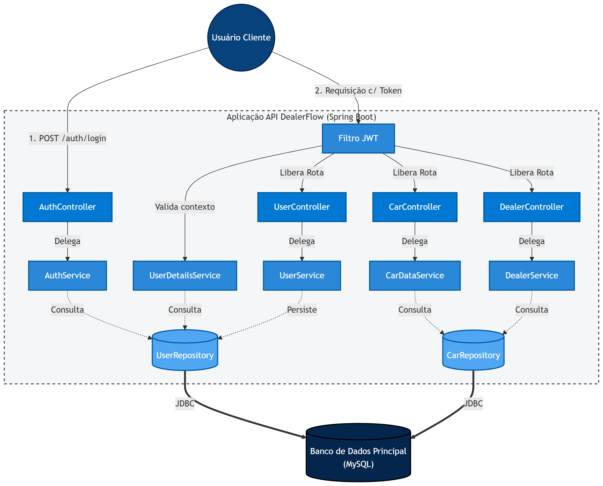
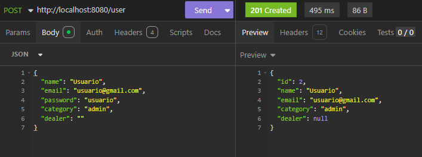
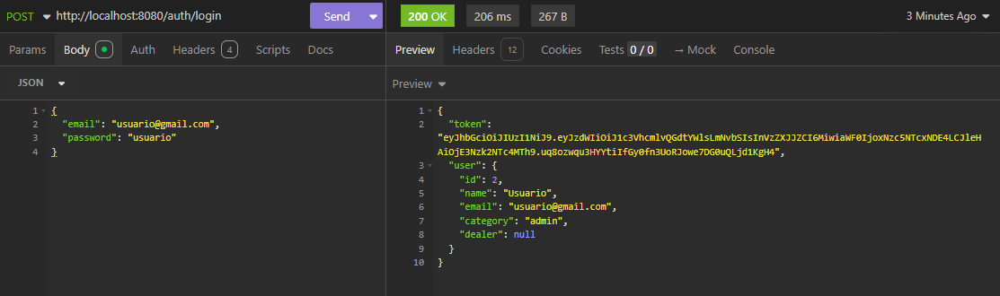
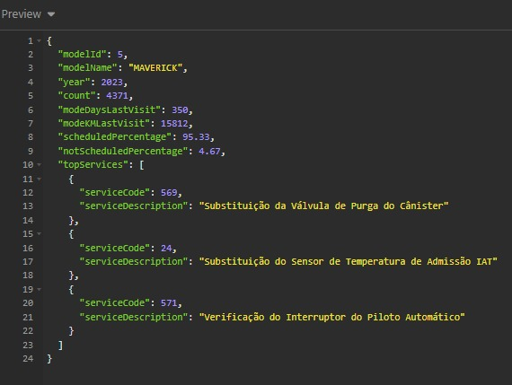
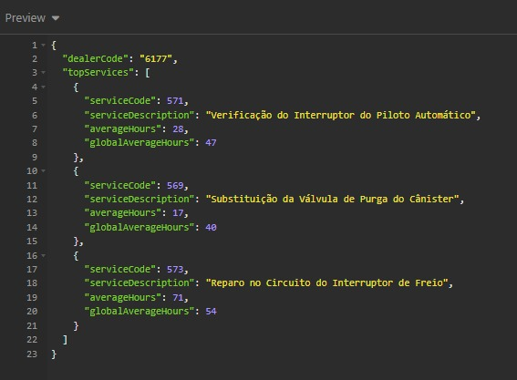

# DealerFlow API

DealerFlow é uma API RESTful desenvolvida em Java com Spring Boot, projetada seguindo os princípios de Arquitetura Orientada a Serviços (SOA). O sistema fornece análises de dados e métricas para concessionárias, modelos de carros e controle de usuários, com autenticação segura via JWT.

Este projeto foi desenvolvido para a entrega da SPRINT 1 da disciplina Arquitetura Orientada a Serviços e Web Services. 

---

## Integrantes do Grupo

*   Gabriel Luni Nakashima - RM558096
*   Gustavo Henrique - RM556712
*   Milena Garcia - RM555111
*   Renan Simões Gonçalves - RM555584
*   Vinicius Vilas Boas - RM557843

---

## Tecnologias Utilizadas

*   **Java** (Linguagem Principal)
*   **Spring Boot** (Framework base)
*   **Spring Web** (Criação da API REST)
*   **Spring Security & JWT** (Autenticação e autorização)
*   **Spring Data JPA** (Persistência de dados)
*   **Jakarta Validation** (Validação de DTOs)
*   **SLF4J** (Logging)

---

## Arquitetura e Estrutura do Projeto

O projeto segue um padrão de arquitetura em camadas, garantindo a separação de responsabilidades:

*   `Controller`: Gerencia as requisições HTTP e define os endpoints da API.
*   `Service`: Contém a regra de negócio central da aplicação (SOA).
*   `Repository`: Interfaces para acesso ao banco de dados via Spring Data.
*   `Model`: Entidades que mapeiam as tabelas do banco de dados.
*   `Dto`: *Data Transfer Objects* para tráfego seguro de dados entre cliente e servidor, evitando exposição das entidades.
*   `Security`: Configurações do Spring Security, filtros JWT e tratamento de exceções de autenticação.
*   `Exception`: Tratamento global de erros (`GlobalExceptionHandler`).

**Diagrama de Arquitetura:**

---

## Endpoints da API

Abaixo estão os endpoints disponíveis organizados por domínio. *Nota: Endpoints protegidos requerem o envio do token JWT no cabeçalho `Authorization: Bearer <token>`.*

### Usuários (`/user`)

*   **POST** `/user`
    *   **Descrição:** Cria um novo usuário no sistema.
    *   **Corpo da Requisição (JSON):** Dados do usuário (`User`).
    *   **Resposta:** `UserDto` criado (Status 201 Created).
*   **GET** `/user/me`
    *   **Descrição:** Retorna as informações do usuário atualmente autenticado.
    *   **Resposta:** `UserDto`.

**Exemplo de Resposta (JSON):**

### Autenticação (`/auth`)

*   **POST** `/auth/login`
    *   **Descrição:** Autentica um usuário no sistema e retorna um token JWT.
    *   **Corpo da Requisição (JSON):** `LoginRequest` (email e senha).
    *   **Resposta:** `AuthResponse` contendo o token de acesso.

**Exemplo de Resposta (JSON):**

### Dados de Modelos de Carros (`/car-data`)

*   **GET** `/car-data`
    *   **Descrição:** Retorna uma lista com os nomes de todos os modelos de carros disponíveis.
    *   **Resposta:** Lista de Strings (`List<String>`).
*   **GET** `/car-data/{model}/{year}`
    *   **Descrição:** Retorna análises detalhadas para um modelo e ano específicos.
    *   **Parâmetros de Rota:** `model` (ID numérico do modelo), `year` (Ano).
    *   **Resposta:** `CarModelAnalyticsDto`.

**Exemplo de Resposta (JSON):**

### Concessionárias (`/dealer`)

*   **GET** `/dealer`
    *   **Descrição:** Retorna uma lista com todos os códigos de concessionárias cadastrados.
    *   **Resposta:** Lista de Strings (`List<String>`).
*   **GET** `/dealer/{dealerCode}`
    *   **Descrição:** Retorna métricas e análises (incluindo top serviços) para uma concessionária específica.
    *   **Parâmetros de Rota:** `dealerCode` (Código da concessionária).
    *   **Resposta:** `DealerAnalytics`.

**Exemplo de Resposta (JSON):**

---

## 🚀 Como Executar o Projeto

1. Clone o repositório.
2. Configure as variáveis de ambiente no arquivo `application.properties` na pasta `resources` (credenciais de banco de dados, chaves secretas do JWT).
3. Execute a classe principal `DealerFlowApplication.java` pela sua IDE.
4. Utilize um cliente HTTP de sua preferência, como o Postman ou Insomnia, para testar os endpoints.